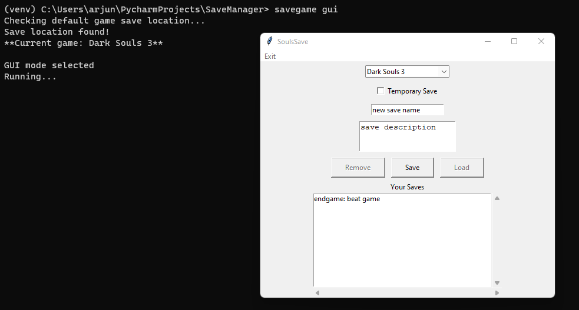

# SoulsSave
_A save manager for [FromSoftware's](https://www.fromsoftware.jp/ww/) video games on PC_

## _About_
This Python CLI/GUI allows you to manage your save folders for various singleplayer games.

Primary features:
- _Currently supports Elden Ring, Sekiro, and Dark Souls III_
- _Create multiple labeled backups of your savegame with custom names/descriptions for reference_
- _Create/restore from a temporary unlabeled backup save_
- _Create/delete custom saves easily_
- _Use GUI or CLI based on your preference_

## Dependencies

* **This program is designed for Windows 10/11**

[Python 3.8](https://www.python.org/downloads/release/python-380/) (you need to install)

[psutil 5.7.0](https://pypi.org/project/psutil/) (installed automatically)

[setuptools 57.0.0](https://pypi.org/project/setuptools/) (installed automatically)


## _Setup_

1. `git clone` or download this repository
2. (Optional) Create a [virtual environment](https://docs.python.org/3/library/venv.html) in the directory and install the program there
3. Install dependencies
   ```
   python -m setup install
   ```
4. Script is ready for use!
   1. Verify by seeing if `savegame-manager` appears as a package when you run `pip list`
5. _Alternative method_
   1. If `setup.py` is not working, you can still manually use the script from the project directory.
   2. Install dependencies manually
   ```
    pip install -r requirements.txt
   ```
   3. Run script with batch file directly
   ```
   ./scripts/savegame.bat
   ```
   
## GUI

To run the program, enter this command in the root directory:
`savegame gui`



## CLI
#### Optional flags

`-l`: display all your current saves

`-c`: indicate that you want to script to use your custom savegame location (i.e. not its default installed location)

**There are _three_ primary modes for this script to run in:**

(Your shell must be in the SaveManager project directory to use these commands!)

### load
```
savegame [-l] [-c] load [-b] [savename]
```

- For when you want to replace the current save file with one of your saved backups

_Optional_:

`-b, --backup`  : restore your temporary backup save

`savename`: the name of the save you want to restore. Leave blank to be prompted after seeing the current list of saves

### save
```
savegame [-l] [-c] save [-b] [savename]
```

- For when you want to save your current savegame in a new backup

_Optional_:

`-b, --backup`  : store your current savegame as a temporary backup that you can easily restore from

`savename`: the name of your custom save. Leave blank to be prompted after seeing the current list of saves

### remove
```
savegame [-l] [-c] remove [savenames...]
```

- For when you want to delete one or more of your backups

_Optional_:

`savenames`: a list of your custom saves to delete. Leave blank to choose which save to delete after seeing the list


### Disclaimer
Although this CLI does create automatic backups of your save file before performing any actions, you should still
back up your original save folder just once before using the script
